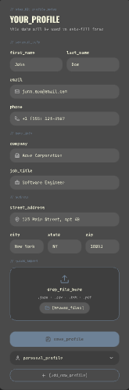
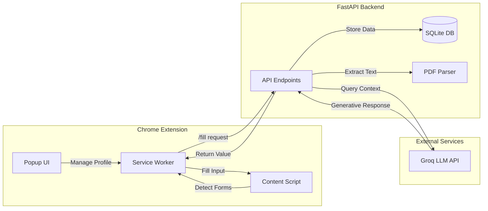

# AI Form Filler

> **Intelligent Form Automation powered by Groq LLMs.**
> A Chrome extension that fills complex web forms using your profile data and uploaded resumes.



## 📋 Table of Contents
- [Overview](#overview)
- [Features](#features)
- [System Architecture](#system-architecture)
- [Installation](#installation)
  - [Backend Setup](#backend-setup)
  - [Extension Setup](#extension-setup)
- [DevOps Infrastructure](#devops-infrastructure)
- [Usage](#usage)

## 🧐 Overview
AI Form Filler solves the tedious task of manually filling out repetitive web forms (job applications, registrations, checkout flows). Unlike standard autofill tools, it uses **Large Language Models (Groq API)** to understand the *context* of each field (e.g., "Tell us about a time you overcame a challenge") and generates relevant, personalized responses based on your uploaded profile and resume.

## ✨ Features
- **Context-Aware Autofill**: Understands field labels and descriptions to generate intelligent answers.
- **Resume Parsing**: Upload your PDF resume; the system extracts and utilizes your work history.
- **Per-Field Control**: A discrete "sparkle" icon appears on every input field for granular control.
- **Privacy First**: Sensitive data is stored locally or processed via a secure backend.
- **Modern UI**: Clean, "Ink Wash" themed interface for profile management.

## 🏗 System Architecture

The system consists of a Chrome Extension frontend and a FastAPI backend, interacting with the Groq API.



## 🚀 Installation

### Backend Setup
The backend is containerized for easy deployment.

1.  **Clone the repository**:
    ```bash
    git clone https://github.com/yourusername/ai-form-filler.git
    cd ai-form-filler/backend
    ```

2.  **Configure Environment**:
    Create a `.env` file with your Groq API key:
    ```env
    GROQ_API_KEY=gsk_...
    ```

3.  **Run with Docker**:
    ```bash
    docker-compose up -d --build
    ```
    The server will start at `http://localhost:8000`.

### Extension Setup
1.  Open Chrome and navigate to `chrome://extensions`.
2.  Enable **Developer mode** (top right).
3.  Click **Load unpacked** and select the `ai-form-filler-extension` folder.
4.  The extension icon should appear in your toolbar.

## 🛠 DevOps Infrastructure

This project includes a complete DevOps pipeline for production deployment:

*   **Docker**: Multi-stage builds for optimized images.
*   **Terraform**: IaC scripts to provision AWS EC2 instances.
*   **Ansible**: Playbooks for server configuration and automated deployment.
*   **Jenkins**: declarative `Jenkinsfile` for CI/CD.
*   **Helm**: Kubernetes charts for scalable orchestration.

See the [DevOps Walkthrough](walkthrough.md) for detailed deployment instructions.

## 💡 Usage
1.  **Create Profile**: Open the extension popup and fill in your details (Name, Experience, etc.) or upload a resume.
2.  **Navigate directly**: Go to any targeted web form (e.g., a job application).
3.  **Click & Fill**: Look for the ✨ icon inside any text field. Click it to let the AI generate a response instantly.

## 📄 License
MIT
